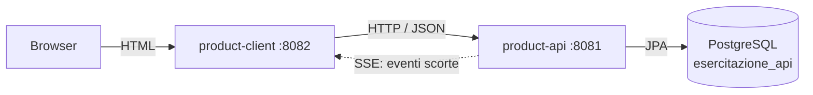
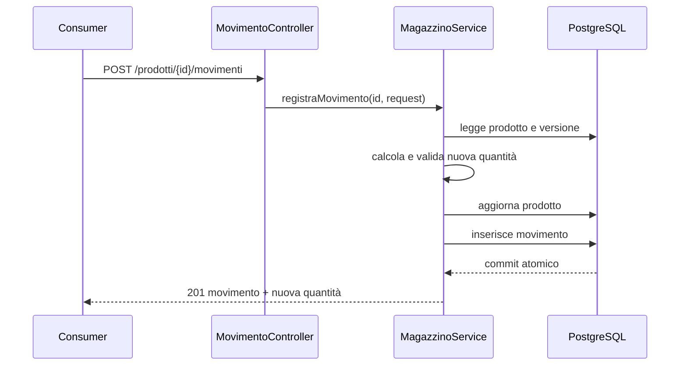
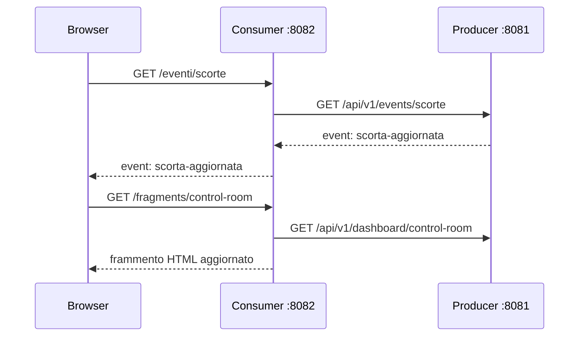

# Architettura e componenti

## Vista generale



La Consumer è un server-side web client: riceve richieste dal browser, interroga
il Producer tramite `RestClient`, prepara il model e rende template Thymeleaf.
Non contiene repository JPA né credenziali del database.

## Producer

Struttura suggerita per funzionalità, mantenendo chiari i livelli:

```text
producer/src/main/java/it/esercitazione/productapi/
├── ProductApiApplication.java
├── prodotto/
│   ├── ProdottoController.java
│   ├── ProdottoService.java
│   ├── ProdottoRepository.java
│   ├── Prodotto.java
│   └── dto/
├── categoria/
│   ├── CategoriaController.java
│   ├── CategoriaService.java
│   ├── CategoriaRepository.java
│   └── Categoria.java
├── magazzino/
│   ├── MovimentoController.java
│   ├── MagazzinoService.java
│   ├── MovimentoRepository.java
│   ├── MovimentoMagazzino.java
│   └── dto/
├── dashboard/
│   ├── DashboardController.java
│   └── DashboardService.java
├── event/
│   ├── ScortaEventPublisher.java
│   └── ScortaEventController.java
└── common/
    ├── exception/
    └── config/
```

Responsabilità:

- **Controller**: protocollo HTTP, validazione iniziale e mapping DTO.
- **Service**: regole di business e confini transazionali.
- **Repository**: interrogazioni e persistenza.
- **Entity**: modello persistente, mai restituito direttamente dalle API.

La registrazione di un movimento è il caso più importante da rendere
transazionale:



## Consumer

```text
consumer/src/main/java/it/esercitazione/productclient/
├── ProductClientApplication.java
├── client/
│   ├── ProdottoApiClient.java
│   ├── CategoriaApiClient.java
│   ├── DashboardApiClient.java
│   └── ScortaEventClient.java
├── web/
│   ├── DashboardWebController.java
│   ├── ProdottoWebController.java
│   ├── ScortaEventWebController.java
│   └── WebExceptionHandler.java
├── dto/
└── config/
```

Template previsti:

```text
templates/
├── dashboard.html
├── control-room.html
├── prodotti/lista.html
├── prodotti/dettaglio.html
└── error/servizio-non-disponibile.html
```

## Configurazione minima

Producer:

```properties
spring.application.name=product-api
server.port=8081
spring.datasource.url=jdbc:postgresql://localhost:5432/esercitazione_api
spring.datasource.username=postgres
spring.jpa.hibernate.ddl-auto=validate
```

Consumer:

```properties
spring.application.name=product-client
server.port=8082
product-api.base-url=http://localhost:8081/api/v1
product-api.connect-timeout=2s
product-api.read-timeout=5s
```

Le chiamate normali usano `RestClient`. Il solo flusso SSE può usare `WebClient`,
perché deve mantenere una risposta aperta. La Consumer espone al browser un
endpoint SSE sul proprio dominio e inoltra gli eventi ricevuti dal Producer:



SSE trasporta una notifica leggera, non l'intero stato della pagina. Alla
ricezione dell'evento, il browser richiede alla Consumer i dati aggiornati. Se
lo stream cade, `EventSource` tenta la riconnessione e la pagina usa un polling
di sicurezza ogni 15 secondi.

## Vincoli architetturali

- Nessuna dipendenza diretta tra i due moduli Java.
- I DTO possono avere la stessa forma, ma non devono essere condivisi tramite un
  modulo comune: il contratto HTTP resta il punto di integrazione.
- La Consumer non deve dipendere da JPA o dal driver PostgreSQL.
- Le credenziali PostgreSQL arrivano da variabili d'ambiente o configurazione locale
  esclusa dal versionamento.
