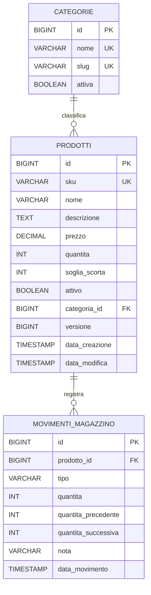

# Modello dati e schema SQL

## Diagramma entità-relazioni



## Tabelle

### `categorie`

| Colonna | Tipo | Vincoli | Significato |
| --- | --- | --- | --- |
| `id` | BIGINT | PK, auto increment | identificativo tecnico |
| `nome` | VARCHAR(100) | not null, unique | nome visualizzato |
| `slug` | VARCHAR(100) | not null, unique | valore stabile per URL/filtri |
| `attiva` | BOOLEAN | not null, default true | utilizzabile per nuovi prodotti |

### `prodotti`

| Colonna | Tipo | Vincoli | Significato |
| --- | --- | --- | --- |
| `id` | BIGINT | PK, auto increment | identificativo tecnico |
| `sku` | VARCHAR(30) | not null, unique | codice di magazzino |
| `nome` | VARCHAR(200) | not null | nome commerciale |
| `descrizione` | TEXT | nullable | descrizione estesa |
| `prezzo` | DECIMAL(10,2) | not null, > 0 | prezzo unitario |
| `quantita` | INT | not null, >= 0 | giacenza corrente |
| `soglia_scorta` | INT | not null, >= 0 | soglia di riordino |
| `attivo` | BOOLEAN | not null, default true | eliminazione logica |
| `categoria_id` | BIGINT | FK, not null | categoria associata |
| `versione` | BIGINT | not null | optimistic locking JPA |
| `data_creazione` | TIMESTAMP | not null | creazione record |
| `data_modifica` | TIMESTAMP | not null | ultima modifica |

### `movimenti_magazzino`

| Colonna | Tipo | Vincoli | Significato |
| --- | --- | --- | --- |
| `id` | BIGINT | PK, auto increment | identificativo movimento |
| `prodotto_id` | BIGINT | FK, not null | prodotto interessato |
| `tipo` | VARCHAR(20) | not null | `CARICO`, `SCARICO`, `RETTIFICA` |
| `quantita` | INT | not null, > 0 | unità caricate/scaricate; per rettifica è il valore finale |
| `quantita_precedente` | INT | not null | giacenza prima dell'operazione |
| `quantita_successiva` | INT | not null | giacenza dopo l'operazione |
| `nota` | VARCHAR(255) | nullable | motivazione o riferimento |
| `data_movimento` | TIMESTAMP | not null | istante dell'operazione |

## DDL di riferimento

Lo script è una specifica del modello. In implementazione dovrebbe diventare una
migrazione Flyway, ad esempio `V1__create_schema.sql`.

```sql
CREATE DATABASE esercitazione_api
  WITH ENCODING 'UTF8';

\connect esercitazione_api

CREATE TABLE categorie (
    id BIGINT GENERATED BY DEFAULT AS IDENTITY PRIMARY KEY,
    nome VARCHAR(100) NOT NULL,
    slug VARCHAR(100) NOT NULL,
    attiva BOOLEAN NOT NULL DEFAULT TRUE,
    CONSTRAINT uk_categorie_nome UNIQUE (nome),
    CONSTRAINT uk_categorie_slug UNIQUE (slug)
);

CREATE TABLE prodotti (
    id BIGINT GENERATED BY DEFAULT AS IDENTITY PRIMARY KEY,
    sku VARCHAR(30) NOT NULL,
    nome VARCHAR(200) NOT NULL,
    descrizione TEXT NULL,
    prezzo DECIMAL(10,2) NOT NULL,
    quantita INT NOT NULL DEFAULT 0,
    soglia_scorta INT NOT NULL DEFAULT 5,
    attivo BOOLEAN NOT NULL DEFAULT TRUE,
    categoria_id BIGINT NOT NULL,
    versione BIGINT NOT NULL DEFAULT 0,
    data_creazione TIMESTAMP NOT NULL DEFAULT CURRENT_TIMESTAMP,
    data_modifica TIMESTAMP NOT NULL DEFAULT CURRENT_TIMESTAMP,
    CONSTRAINT uk_prodotti_sku UNIQUE (sku),
    CONSTRAINT fk_prodotti_categoria
        FOREIGN KEY (categoria_id) REFERENCES categorie(id),
    CONSTRAINT ck_prodotti_prezzo CHECK (prezzo > 0),
    CONSTRAINT ck_prodotti_quantita CHECK (quantita >= 0),
    CONSTRAINT ck_prodotti_soglia CHECK (soglia_scorta >= 0)
);

CREATE TABLE movimenti_magazzino (
    id BIGINT GENERATED BY DEFAULT AS IDENTITY PRIMARY KEY,
    prodotto_id BIGINT NOT NULL,
    tipo VARCHAR(20) NOT NULL,
    quantita INT NOT NULL,
    quantita_precedente INT NOT NULL,
    quantita_successiva INT NOT NULL,
    nota VARCHAR(255) NULL,
    data_movimento TIMESTAMP NOT NULL DEFAULT CURRENT_TIMESTAMP,
    CONSTRAINT fk_movimenti_prodotto
        FOREIGN KEY (prodotto_id) REFERENCES prodotti(id),
    CONSTRAINT ck_movimenti_tipo
        CHECK (tipo IN ('CARICO', 'SCARICO', 'RETTIFICA')),
    CONSTRAINT ck_movimenti_quantita CHECK (quantita > 0),
    CONSTRAINT ck_movimenti_precedente CHECK (quantita_precedente >= 0),
    CONSTRAINT ck_movimenti_successiva CHECK (quantita_successiva >= 0)
);

CREATE INDEX idx_prodotti_nome ON prodotti(nome);
CREATE INDEX idx_prodotti_categoria_attivo
    ON prodotti(categoria_id, attivo);
CREATE INDEX idx_movimenti_prodotto_data
    ON movimenti_magazzino(prodotto_id, data_movimento DESC);
```

Il comando `\connect` appartiene al client `psql`. `data_modifica` viene
aggiornata dall'applicazione tramite auditing JPA (`@PreUpdate` o equivalente),
evitando sintassi specifiche di altri database.

## Dati iniziali minimi

- Categorie: Informatica, Accessori, Audio, Storage, Mobile, Networking, Ufficio.
- Almeno 20 prodotti, riprendendo i dati della consegna originale e aggiungendo
  uno SKU (`INF-LAP-001`, `ACC-MOU-001`, ecc.) e una soglia di scorta.
- Due o tre prodotti devono partire sotto soglia per rendere visibile la
  dashboard fin dal primo avvio.

I prodotti iniziali possono avere quantità valorizzata direttamente; non è
necessario generare movimenti retroattivi per il seed.

## Dati derivati per Inventory Pulse

La control room non richiede altre tabelle. Salute, priorità, distribuzione per
categoria e feed recente vengono calcolati a partire da `prodotti`, `categorie`
e `movimenti_magazzino`. Gli eventi SSE sono notifiche effimere: se un client ne
perde uno, ricarica semplicemente lo stato corrente dalle API.
