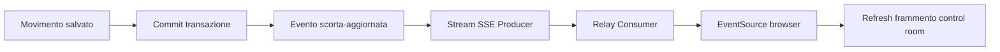

# Inventory Pulse — feature distintiva

## Il colpo d'occhio

Inventory Pulse è una control room di magazzino in tempo reale. Durante una demo
si apre `/control-room` e, da Postman o da un secondo browser, si registra uno
scarico. Senza ricaricare la pagina:

1. il feed mostra il nuovo movimento;
2. quantità e valore del magazzino cambiano;
3. l'indicatore di salute si aggiorna;
4. se viene superata una soglia, il prodotto entra nel radar di riordino;
5. il badge passa, per esempio, da `OK` ad `ALTA`.

È un effetto evidente, ma nasce da concetti didattici concreti: transazioni,
eventi applicativi, aggregazioni SQL, streaming HTTP e resilienza del client.

## Perché SSE

Server-Sent Events è adatto perché il flusso è unidirezionale: il server deve
solo notificare il browser che qualcosa è cambiato.

| Soluzione | Valutazione |
| --- | --- |
| polling soltanto | semplice, ma poco reattivo e ripetitivo |
| WebSocket | potente, ma eccessivo per notifiche unidirezionali |
| SSE | HTTP standard, riconnessione nativa, complessità contenuta |

SSE non è usato come archivio affidabile. Il database rimane la fonte di verità
e ogni notifica provoca il recupero di uno snapshot aggiornato.

## Flusso applicativo

Pubblicare dopo il commit evita che la UI mostri una variazione poi annullata dal
database. Più eventi ravvicinati possono essere accorpati dal browser con un
debounce di circa 250 ms, effettuando un solo refresh dello snapshot.

## Stato della connessione

La UI espone tre stati:

- `LIVE`: stream connesso e heartbeat ricevuto;
- `RICONNESSIONE…`: connessione persa, tentativo automatico in corso;
- `AGGIORNAMENTO PERIODICO`: SSE non disponibile, polling ogni 15 secondi.

Il passaggio tra gli stati non blocca mai la consultazione dei dati già
visualizzati.

## Confine della feature

Sono volutamente esclusi broker esterni, persistenza degli eventi, notifiche
push e sincronizzazione multi-regione. In un esercizio locale aggiungerebbero
infrastruttura, ma non renderebbero più interessante la dimostrazione.

## Demo suggerita

1. Aprire la control room con due prodotti sotto soglia.
2. Eseguire uno scarico che porta un prodotto a zero.
3. Osservare feed, indicatore e priorità diventare `CRITICA`.
4. Eseguire un carico sufficiente a superare la soglia.
5. Osservare il prodotto uscire dal radar di riordino.
6. Spegnere e riavviare il Producer per mostrare riconnessione e recupero.

Questa sequenza dimostra l'intero flusso Browser → Consumer → Producer → PostgreSQL
senza ricorrere a effetti puramente decorativi.
